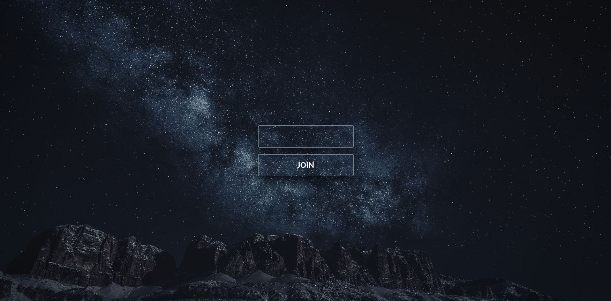
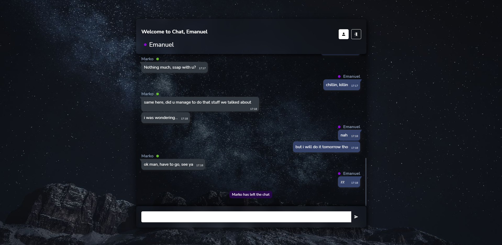

# Chat Application




## Overview

This is an application that simulates chat using [Scaledrone](https://https://www.scaledrone.com/)

In the chat u will be able to send messages to each other using a Nickname u set on login page.
U will be able to see when someone logged in or logged out of the chat. You can show or hide members list.
Every user will get a random color next to a name.
Enjoy chatting :)

### Built with

- JSX
- SCSS
- React
- Framer motion (animations)

Clone the project

```bash
  git clone https://github.com/Vj3ko/chat_app
```

Go to the project directory

```bash
  cd chat_app
```

Register on [Scaledrone](https://https://www.scaledrone.com/) service and get a KEY.
Create .env file and add REACT_APP_SCALEDRONE_KEY={your key}

Install dependencies

```bash
  npm install
```

Start the app

```bash
  npm start
```

[Live preview of a Chat App](https://chat-app-flax-alpha.vercel.app/)

## Author

<p><a href="https://www.linkedin.com/in/vdizdar/"></a>&nbsp;
